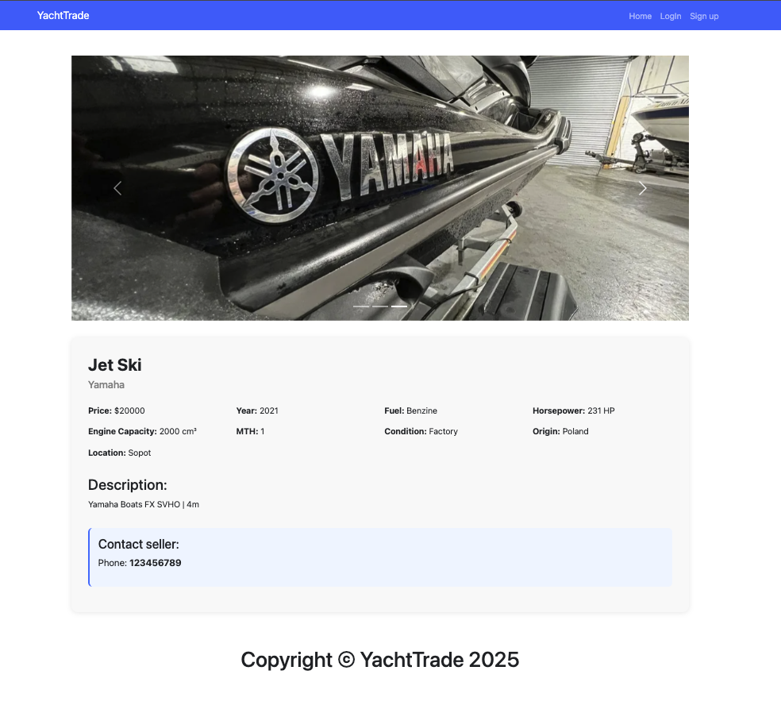

<!-- ──────────────────────────────────────────────────────────────────────────────
 README – YachtTrade
─────────────────────────────────────────────────────────────────────────────── -->

# YachtTrade ⛵️  
> **MERN Stack • CRUD • Multer upload • Regex search**

Marketplace for yachts and watercrafts: list, search, sell, manage.  
Built as a portfolio project to demonstrate full‑stack skills (design, security, CI/CD).

---

## 📋 API Endpoints

### 📢 Ads

| Method | Endpoint                        | Auth Required | Description                                                                 |
|--------|----------------------------------|----------------|-----------------------------------------------------------------------------|
| GET    | `/ads`                          | ❌             | Fetches all ads                                                              |
| GET    | `/ads/:id`                      | ❌             | Fetches a single ad by ID                                                   |
| POST   | `/ads`                          | ✅             | Creates a new ad (supports up to 3 image uploads)                           |
| PUT    | `/ads/:id`                      | ✅             | Updates an existing ad and replaces images if new ones are uploaded         |
| DELETE | `/ads/:id`                      | ✅             | Deletes an ad by ID, including associated image files                       |
| GET    | `/ads/search/:searchPhrase`     | ❌             | Searches ads by `make` field (case-insensitive partial match)              |

---

### 🔐 Auth

| Method | Endpoint         | Auth Required | Description                                       |
|--------|------------------|----------------|---------------------------------------------------|
| POST   | `/register`      | ❌             | Registers a new user                              |
| POST   | `/login`         | ❌             | Logs in a user and starts a session               |
| GET    | `/user`          | ✅             | Returns current logged-in user's data             |
| DELETE | `/logout`        | ✅             | Logs out the current user and destroys the session|

---

## Demo

| View                     | Screenshot |
|--------------------------|------------|
| **Home**                 |  |
| **Single Ad**            |  |
| **Register page**        |  |
| **Login page**           |  |
| **Edit Ad**              |  |
| **Delete confirmation**  |  |
| **Unauthorized access**  |  |

---

## Features

| Category            | Details |
|---------------------|---------|
| **Ads – CRUD**      | Create, read, update, delete (owner‑only) |
| **Image upload**    | Multer → `/public/uploads` with MIME/extension validation |
| **Search**          | `GET /ads/search/:phrase` – case‑insensitive regex |
| **Authentication**  | Cookie session, password hashing (bcrypt), Google OAuth 2.0 *(in progress)*
| **Responsive UI**   | Bootstrap 5 grid, carousel |
| **UX**              | Inline form validation, toast errors, loading spinners |

---

## Tech stack

### Front‑end

| Package / Tool                      | Version | Purpose |
|-------------------------------------|---------|---------|
| **React**                           | 19.x    | UI library |
| **react‑router‑dom**                | 7.x     | Routing |
| **Redux** / **@reduxjs/toolkit**    | 5.x     | State management |
| **react‑redux**                     | 9.x     | React bindings |
| **redux‑devtools‑extension**        | 2.13.x  | Debugging |
| **Bootstrap 5** + **react‑bootstrap** | 5.3 / 2.10.x | UI components |
| **Sass / SCSS**                     | 1.62.x  | Styling |
| **sass‑loader**                     | 13.x    | Webpack loader |
| **CRA (react‑scripts)**             | 5.0.1   | Build & dev server |
| **Jest** + **Testing Library**      | latest  | Unit / integration tests |
| **web‑vitals**                      | 2.1.x   | Perf metrics |

### Back‑end

| Package / Tool        | Version | Purpose |
|-----------------------|---------|---------|
| **Node.js**           | 20‑LTS  | Runtime |
| **Express**           | 5 β     | Web framework |
| **MongoDB**           | 6.x     | Database |
| **Mongoose**          | 8.x     | ODM |
| **Multer**            | 1.4.x   | File upload |
| **express‑session**   | 1.18.x  | Sessions |
| **connect‑mongo**     | 5.x     | Store sessions in MongoDB |
| **Passport** (+ Google) | 0.7.x | OAuth 2 |
| **bcryptjs**          | 3.x     | Hashing |
| **cors**              | 2.8.x   | CORS headers |
| **mongo‑sanitize**    | 1.1.x   | NoSQL‑injection defence |
| **dotenv**            | latest  | Env variables |
| **nodemon** (dev)     | 3.x     | Auto‑reload |

---

# Clone the repo and go into it
git clone https://github.com/mikolajchm/yachttrade.git
cd yachttrade

# Backend (integrated with frontend)
cd backend
rm -rf node_modules
rm yarn.lock
yarn install

# Build frontend if not already built
cd ../frontend
yarn install
yarn build          # creates production React build

# Copy the frontend build to backend's public folder (if not done yet)
cp -r build ../backend/public

# Start the backend server
cd ../backend
yarn start          # runs the app at http://localhost:8000